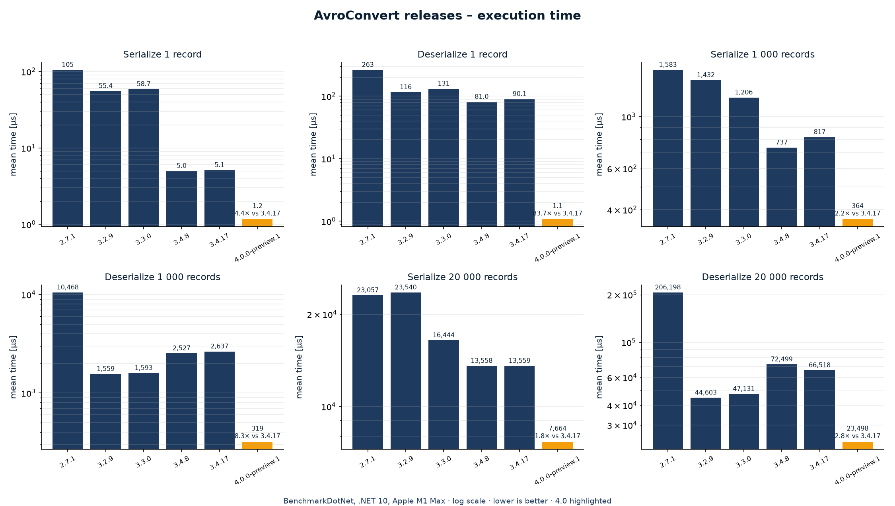

<p align="center">
  <picture>
    <source media="(prefers-color-scheme: dark)" srcset="./docs/logo-dark.png">
    
  </picture>
</p>

<p align="center">
  Rapid Apache Avro serializer for .NET
</p>

<p align="center">
 <a href="https://github.com/AdrianStrugala/AvroConvert"></a>
 <a href="https://adrianstrugala.github.io/AvroConvert/"></a>
 <br>
 <a href="https://github.com/AdrianStrugala/AvroConvert/actions/workflows/build&test.yml"></a>
 <a href="./LICENSE.md"></a>
 <a href="https://www.nuget.org/packages/AvroConvert"></a>
</p>

## Installation

```
dotnet add package AvroConvert
```

## Docs

[Apache Avro format documentation](http://avro.apache.org/)

[First steps with Avro in the .NET](https://www.c-sharpcorner.com/article/how-to-work-with-avro-data-type-in-net-environment/)

[AvroConvert documentation](https://github.com/AdrianStrugala/AvroConvert/tree/master/docs)


## Benefits

**Avro format combines readability of JSON and data compression of binary serialization.**

|                                                               | AvroConvert                                | Apache.Avro | Newtonsoft.Json |
|---------------------------------------------------------------|:------------------------------------------:|:-----------:|:---------------:|
| Rapid serialization                                            |                      ✔️                     |      ✔️      |        ✔️        |                       
| Low memory allocation                                         |                      ✔️                     |      ✔️      |        ✔️        |
| Readable schema of data structure                                      |                      ✔️                     |      ✔️      |        ✔️        |
| Support for C# native objects (Dictionary, List, DateTime...) |                      ✔️                     |      ❌      |        ✔️        |
| Built-in data encryption                                          |                      ✔️                     |      ✔️      |        ❌        |
| Support for compression codecs                                | Deflate<br/>  Snappy<br/> GZip<br/> Brotli |   Deflate   |        ❌        |

Introducing Avro to the projects brings three main benefits:
* Reduction of data size and storage cost
* Decrease of the communication time and the network traffic between microservices
* Increased security - the data is not visible in plain text format


Article describing Avro format specification and Avro API idea: https://www.c-sharpcorner.com/blogs/avro-rest-api-as-the-evolution-of-json-based-communication-between-mic

**Conclusion:**
Using Avro for communication between your services significantly reduces data size and network traffic. Additionally choosing encoding (compression algorithm) can improve the results even further.


## Features


* Serialization
```csharp
 byte[] avroObject = AvroConvert.Serialize(object yourObject);
```
<br/>

* Deserialization
```csharp
CustomClass deserializedObject = AvroConvert.Deserialize<CustomClass>(byte[] avroObject);
```
<br/>

* Read schema from Avro object

```csharp
string schemaInJsonFormat = AvroConvert.GetSchema(byte[] avroObject)
```
<br/>

* Deserialization of large collection of Avro objects one by one

```csharp
using (var reader = AvroConvert.OpenDeserializer<CustomClass>(new MemoryStream(avroObject)))
{
    while (reader.HasNext())
    {
        var item = reader.ReadNext();
        // process item
    }
}
```

* Generation of C# models from Avro file or schema

```csharp
  string resultModel = AvroConvert.GenerateModel(avroObject);
```

* Conversion of Avro to JSON directly

```csharp
  var resultJson = AvroConvert.Avro2Json(avroObject);
```

**Extended list:** <br>
1. Serialization of .NET object to Avro format 
   - [Standard](https://github.com/AdrianStrugala/AvroConvert/blob/master/docs/Documentation.md#serialization)
   - [Excluding header](https://github.com/AdrianStrugala/AvroConvert/blob/master/docs/Documentation.md#headless-serialization-and-deserialization)
2. Deserialization of Avro data to .NET object 
   - [Standard](https://github.com/AdrianStrugala/AvroConvert/blob/master/docs/Documentation.md#serialization)
   - [Excluding header](https://github.com/AdrianStrugala/AvroConvert/blob/master/docs/Documentation.md#headless-serialization-and-deserialization)
   - [Processing collection items one by one](https://github.com/AdrianStrugala/AvroConvert/blob/master/docs/Documentation.md#deserialization-of-large-collection-of-avro-objects-one-by-one)
3. Other Avro data related operations
   - [Merge Avro objects](https://github.com/AdrianStrugala/AvroConvert/blob/master/docs/Documentation.md#merge)
   - [JSON to Avro conversion](https://github.com/AdrianStrugala/AvroConvert/blob/master/docs/Documentation.md#json2avro)
   - [Avro to JSON conversion](https://github.com/AdrianStrugala/AvroConvert/blob/master/docs/Documentation.md#avro2json)
4. Schema related
   - [Get schema from Avro data](https://github.com/AdrianStrugala/AvroConvert/blob/master/docs/Documentation.Schema.md#reading-avro-schema-from-avro-encoded-object)
   - [Generate schema from .NET object](https://github.com/AdrianStrugala/AvroConvert/blob/master/docs/Documentation.md#generating-avro-schema-for-c-classes)
   - [Generate .NET model from Avro data or schema](https://github.com/AdrianStrugala/AvroConvert/blob/master/docs/Documentation.Schema.md#generate-model)
   - [Generate Avro schema for JSON data](https://github.com/AdrianStrugala/AvroConvert/blob/master/src/AvroConvert/SchemaConvert.GenerateFromJson.cs)


[Full documentation](https://github.com/AdrianStrugala/AvroConvert/tree/master/docs)


## Performance

4.0 compiles serializers per (schema, type); compared with earlier releases on the same machine (BenchmarkDotNet, .NET 10, log scale):



Full numbers and memory chart: [docs/benchmarks](docs/benchmarks/2026-10-08-versions-2.7.1-to-4.0.md).

## License

AvroConvert is source-available and **free for noncommercial use and for small companies**:

| You are… | Licence | Cost |
|---|---|---|
| Individual, student, non-profit, public institution, research or evaluation | [PolyForm Noncommercial 1.0.0](licenses/PolyForm-Noncommercial-1.0.0.md) | Free |
| Company with fewer than 100 people **and** under 1,000,000 USD annual revenue | [PolyForm Small Business 1.0.0](licenses/PolyForm-Small-Business-1.0.0.md) | Free |
| Any other company or organisation | [Commercial Licence](licenses/Commercial.md) | Annual, per organisation, unlimited developers — [buy at soltechnology.dev](https://soltechnology.dev/avroconvert/) |

Declare the licence you rely on (optional, silences a one-time `Trace` warning; functionality is never restricted):

```csharp
AvroConvert.License = AvroLicense.NonCommercial;          // or AvroLicense.SmallBusiness
AvroConvert.License = AvroLicense.Commercial("AVC1.…");   // licence key received by e-mail after purchase
```

or set the environment variable `AVROCONVERT_LICENSE` to `NonCommercial`, `SmallBusiness` or the key. Details in [LICENSE.md](LICENSE.md).
Versions 3.x remain under CC BY-NC-SA 3.0.

## Contribution

We want to improve AvroConvert as much as possible. If you have any idea, found next possible feature, optimization opportunity or better way for integration, leave a comment or pull request.


Thank you a million [to all the contributors](https://github.com/AdrianStrugala/AvroConvert/graphs/contributors) to the library, including those that raise issues, started conversations, and those who send pull requests. Thank you!

These amazing people have contributed to AvroConvert:

<a href="https://github.com/AdrianStrugala/AvroConvert/graphs/contributors">
  
</a>


## Related Work  

- [](https://adrianstrugala.github.io/AvroConvert/)- online Avro Schema to C# model converter

- [](https://www.nuget.org/packages/SolTechnology.Avro.Http/) - Library containing functionalities, which enable communication between microservices via Http using Avro data format

- [](https://www.nuget.org/packages/SolTechnology.Avro.Kafka/) - Library containing components needed for Confluent Kafka integration

- [Avro API article](https://www.c-sharpcorner.com/blogs/avro-rest-api-as-the-evolution-of-json-based-communication-between-mic) 
